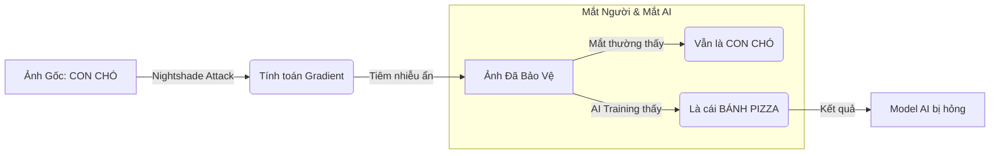
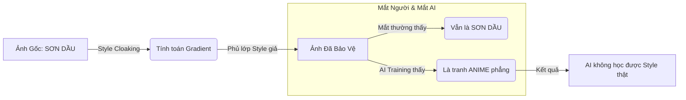

# Hope-AD: Cơ chế Phòng vệ (Advanced Adversarial Defense)

Dự án **Hope-AD** (Hope Adversarial Defense) cung cấp một bộ công cụ bảo vệ bản quyền hình ảnh, được thiết kế để chống lại việc khai thác ngoài ý muốn bởi các mô hình Generative AI (Stable Diffusion, LoRA, etc.). Hệ thống tích hợp hai phương pháp phòng vệ dựa trên nhiễu adversarial perturbations, tiêu biểu là **Nightshade** và **Glaze**.

**Phiên bản hiện tại:** 1.0.0

> [!NOTE]
>
> **Tải xuống Bộ Cài đặt (Window Installer):**
>
> [Liên kết Google Drive](https://drive.google.com/drive/folders/1HCHGcMTn8I07X_6m4h1vv75ZJML2jzQM?usp=drive_link)

---

## 1. Cơ sở Lý thuyết & Cơ chế Hoạt động

Hope-AD vận dụng các nguyên lý tối ưu hóa lồi (convex optimization) trên latent space của các Diffusion Models để tạo ra các nhiễu không thể nhận biết bằng mắt thường nhưng có tác động đủ mạnh đến quá trình train và machine-learning của máy học.

### 1.1. Nightshade: Concept Poisoning

**Mục tiêu:** Gây hiện tượng "Model Mode Collapse" hoặc "Concept Bleeding" khi mô hình AI cố gắng học từ dữ liệu được bảo vệ. Nightshade biến đổi sự liên kết ngữ nghĩa (Context Link) giữa hình ảnh và văn bản mô tả.



**Mô hình Toán học:**
Giả sử $x$ là hình ảnh gốc, $c_{source}$ là khái niệm gốc (ví dụ: "chó"), và $c_{target}$ là khái niệm mục tiêu (ví dụ: "mèo"). Chúng ta tìm kiếm một nhiễu $\delta$ tối ưu hóa hàm mục tiêu sau:

$$ \min*{\delta} || \mathcal{E}(x+\delta) - \mathcal{E}(x*{target}) ||\_2^2 + \lambda ||\delta||\_p $$

Trong đó:

- $\mathcal{E}(\cdot)$ là hàm ánh xạ của Feature Extractor (ví dụ: CLIP Vision Encoder).
- $x_{\text{target}}$ là hình ảnh neo (anchor image) đại diện cho $c_{\text{target}}$.
- $\|\delta\|_p$ là ràng buộc chuẩn $L_p$ (thường là $L_\infty$ hoặc $L_2$) để đảm bảo chất lượng thị giác (perceptual quality).

**Hiệu quả:** Khi mô hình được fine-tune trên dữ liệu nhiễm độc Nightshade, gradient descent sẽ tối ưu hóa trọng số mô hình theo hướng sai lệch, làm hỏng khả năng biểu diễn đặc trưng của khái niệm đó.

<div align="center">
  <table border="1" width="100%">
    <thead>
      <tr>
        <th align="center" width="15%">Mô tả</th>
        <th align="center" width="42%">Trước (Before)</th>
        <th align="center" width="42%">Sau (After)</th>
      </tr>
    </thead>
    <tbody>
      <tr>
        <td align="center"><strong>Trường hợp 1</strong></td>
        <td align="center">
          
        </td>
        <td align="center">
          
        </td>
      </tr>
      <tr>
        <td align="center"><strong>Trường hợp 2</strong></td>
        <td align="center">
          
        </td>
        <td align="center">
          
        </td>
      </tr>
      <tr>
        <td colspan="3" align="left" style="padding: 10px;">
          <strong>Giải thích:</strong>
          <ul>
            <li><strong>Nightshade:</strong> LoRA được train ở các trường hợp trước là các hình ảnh sạch chưa được đầu độc được gen ra hoàn toàn bình thường bằng TXT2IMG. Nhưng, các output đã đầu độc bằng Nightshade của trường hợp sau cho ra hình ảnh dị dạng, sai lệch...</li>
            <li><strong>Model (checkpoint):</strong> counterfeitV30_30</li>
            <li><strong>LoRA 1 (Clean):</strong> clean_10. (clean)</li>
            <li><strong>LoRA 2 (NaiXay):</strong> Naixay_10. (poisoned)</li>
            <li><strong>SPM:</strong> DPM++ 2MSDE</li>
            <li><strong>Prompt:</strong> 1 girl, solo, hair ornament</li>
            <li><strong>Prompt LoRA 1:</strong> 1 girl, solo, hair ornament, &lt;LoRA:clean:2&gt; fcc_clean</li>
            <li><strong>Prompt LoRA 2:</strong> 1 girl, solo, hair ornament, &lt;LoRA:naixay:2&gt; fcc_naixay</li>
          </ul>
        </td>
      </tr>
    </tbody>
  </table>
</div>

<br>
<br>

<div align="center">
  <table border="1" width="100%">
    <thead>
      <tr>
        <th align="center" width="20%">Trạng thái</th> 
        <th align="center" width="40%">Trường hợp 1 (Case 1)</th>
        <th align="center" width="40%">Trường hợp 2 (Case 2)</th>
      </tr>
    </thead>
    <tbody>
      <tr>
        <td align="center"><strong>Trước (Before)</strong></td>
        <td align="center">
          
        </td>
        <td align="center">
          
        </td>
      </tr>
      <tr>
        <td align="center"><strong>Sau (After)</strong></td>
        <td align="center">
          
        </td>
        <td align="center">
          
        </td>
      </tr>
      <tr>
        <td colspan="3" align="left" style="padding: 10px;">
          <strong>Giải thích:</strong>
          <ul>
            <li><strong>Glaze:</strong> LoRA được train ở các trường hợp trước là các hình ảnh sạch chưa được đầu độc được gen ra hoàn toàn bình thường bằng IMG2IMG. Nhưng, các output đã đầu độc bằng Nightshade của trường hợp sau cho ra hình ảnh dị dạng, sai lệch...</li>
            <li><strong>Model (checkpoint):</strong> counterfeitV30_30</li>
            <li><strong>LoRA 1 (Clean):</strong> clean_10. (clean)</li>
            <li><strong>LoRA 2 (glaze):</strong> glaze_10. (cloaked)</li>
            <li><strong>SPM:</strong> DPM++ 2MSDE</li>
            <li><strong>Prompt:</strong> 1 girl, solo</li>
            <li><strong>Prompt LoRA 1:</strong> 1 girl, solo, &lt;LoRA:clean:2&gt; fcc_clean</li>
            <li><strong>Prompt LoRA 2:</strong> 1 girl, solo, &lt;LoRA:glaze:2&gt; fcc_glaze</li>
          </ul>
        </td>
      </tr>
    </tbody>
  </table>
</div>

<br>

### 1.2. Glaze: Style Cloaking

**Mục tiêu:** Ngăn chặn việc sao chép phong cách nghệ thuật (Style Mimicry) bằng cách tạo ra một sự dịch chuyển đặc trưng (Feature Shift) trong không gian biểu diễn.



**Mô hình Toán học:**
Glaze tối ưu hóa $\delta$ để đẩy biểu diễn của hình ảnh trong không gian tiềm ẩn về phía một phong cách đối lập $S_{target}$, trong khi vẫn giữ nguyên nội dung ngữ nghĩa $C$.

$$ \min*{\delta} [ \mathcal{L}*{style}(\Phi(x+\delta), \Phi(S*{target})) + \alpha \mathcal{L}*{content}(\Psi(x+\delta), \Psi(x)) ] $$

Trong đó:

- $\Phi(\cdot)$ là Style Extractor (e.g., Gram matrices của các lớp VGG).
- $\Psi(\cdot)$ là Content Extractor.
- $\alpha$ là hệ số cân bằng giữa độ bền vững của lớp phủ và chất lượng hình ảnh.

Kết quả là mô hình AI sẽ "nhìn thấy" một phong cách hoàn toàn khác (ví dụ: Anime $\to$ Abstract), khiến việc bắt chước phong cách gốc gặp khó khăn hơn.

<div align="center">
  <table border="1" width="100%">
    <thead>
      <tr>
        <th align="center">Mô tả</th>
        <th align="center">Trước (Before)</th>
        <th align="center">Sau (After)</th>
      </tr>
    </thead>
    <tbody>
      <tr>
        <td align="center"><strong>Trường hợp 1</strong></td>
        <td align="center">
          
        </td>
        <td align="center">
          
        </td>
      </tr>
      <tr>
        <td align="center"><strong>Trường hợp 2</strong></td>
        <td align="center">
          
        </td>
        <td align="center">
          
        </td>
      </tr>
      <tr>
        <td colspan="3" align="left" style="padding: 10px;">
          <strong>Giải thích</strong>
          <ul>
            <li><strong>Glaze:</strong> Ảnh gốc (Clean) hoạt động bình thường với IMG2IMG. Ngược lại, ảnh đã qua xử lý Glaze chứa lớp nhiễu "style cloak" khiến AI hiểu sai hoàn toàn ngữ cảnh, dẫn đến kết quả đầu ra bị méo mó và mất đi các chi tiết nghệ thuật ban đầu.</li>
          </ul>
        </td>
      </tr>
    </tbody>
  </table>
</div>

---

## 2. Hướng dẫn Cài đặt (Dành cho Devs)

Nếu các bạn devs muốn phát triển hoặc chạy mã nguồn trực tiếp từ Python (thay vì dùng file .exe), vui lòng tuân thủ quy trình chuẩn hóa sau:

**Yêu cầu:**

- Python 3.10+
- NVIDIA GPU (VRAM $\ge$ 6GB đề xuất)
- CUDA Toolkit phù hợp với phiên bản PyTorch.

**Quy trình:**

1.  **Khởi tạo môi trường ảo (Virtual Environment):**
    Để đảm bảo sự cô lập của các gói thư viện (dependencies), hãy sử dụng `venv`:

    ```bash
    python -m venv venv
    .\venv\Scripts\activate
    ```

2.  **Cài đặt thư viện:**

    ```bash
    pip install --upgrade pip
    pip install -r requirements.txt
    ```

    _Lưu ý: Quá trình này sẽ tải về `torch`, `diffusers`, `transformers` và các thư viện cần thiết khác._

3.  **Vận hành:**
    Để khởi chạy giao diện người dùng (GUI) thông qua Python wrapper (nếu có) hoặc sử dụng CLI engine trực tiếp:
    ```bash
    python engine.py --help
    ```

---

## 3. Bản quyền & Tuyên bố Miễn trừ Trách nhiệm

Dự án này được phát triển với mục đích bảo vệ quyền sở hữu trí tuệ của các nhà sáng tạo nội dung trong kỷ nguyên AI.

- **Mã nguồn:** Thuộc sở hữu của HopeADeff.
- **Trách nhiệm:** Người dùng chịu trách nhiệm về việc sử dụng công cụ này đúng mục đích pháp lý. Chúng mình không chịu trách nhiệm cho bất kỳ việc sử dụng sai mục đích nào.

---

_Tài liệu được cập nhật lần cuối: 12/2025_

| Phương pháp             | Vector Mục tiêu                 | Hiệu quả                                                                                                |
| ----------------------- | ------------------------------- | ------------------------------------------------------------------------------------------------------- |
| **Adversarial Noise**   | Nhiễu tần số cao                | **Thấp**: Dễ bị loại bỏ bởi khử nhiễu và nén ảnh.                                                       |
| **Nightshade (Poison)** | Sai lệch khái niệm              | **Khuyên dùng**: Gây hiện tượng catastrophic forgetting hoặc sai lệch khái niệm trong trọng số mô hình. |
| **Glaze (Cloak)**       | Chuyển đổi phong cách đặc trưng | **Khuyên dùng**: Hiệu quả chống lại Style Transfer và tinh chỉnh LoRA.                                  |

> **Tóm lại**:
>
> "Nightshade và Glaze là 2 lựa chọn được chúng mình khuyến khích sử dụng để đạt hiệu quả tốt nhất." - _Noah_
>
> "lmao" - _QD_

## Câu hỏi thường gặp (FAQ)

### Q: Hiệu quả trên các tập dữ liệu nhỏ (Few-Shot Learning)?

**A: Hiệu quả cao.** Việc tinh chỉnh mô hình khuếch tán (finetuning) như LoRA hay DreamBooth rất nhạy cảm với chất lượng của tập dữ liệu nhỏ ($N \approx 5-20$). Nếu **Tỷ lệ Nhiễm độc (Poison Ratio)** cao (ví dụ: 100% tập huấn luyện bị nhiễu), các gradient sẽ liên tục phân kỳ khỏi điểm cực tiểu toàn cục, dẫn đến **Overfitting on Poisoned Features**.

### Q: Tại sao Img2Img/Interrogation vẫn hoạt động?

**A: Sự khác biệt giữa Huấn luyện (Backpropagation) và Suy luận (Inference/Forward Pass).**

- **Suy luận (Inference)**: Mô hình hoạt động như một "Denoising Autoencoder". Cường độ khử nhiễu mạnh ($>0.5$) hoặc hướng dẫn IP-Adapter có thể tái tạo nội dung hình ảnh vì nhiễu được thiết kế để bán ẩn (semi-imperceptible).
- **Huấn luyện (Training)**: Quá trình tối ưu hóa giảm thiểu hàm mất mát dựa trên các đặc trưng tiềm ẩn _bị nhiễm độc_. Mô hình cập nhật trọng số để ánh xạ khái niệm hình ảnh "A" sang mục tiêu độc hại "B". Vì Hope-AD tấn công quá trình **Gradient Descent**, nó được thiết kế cụ thể để phá vỡ quá trình huấn luyện, không phải quá trình xem ảnh.

### Q: Độ toàn vẹn hình ảnh vs. Cường độ bảo vệ?

A: Tool sử dụng thuật toán tối ưu hóa để giữ sự thay đổi ở mức thấp nhất (gần như vô hình với mắt thường). Tuy nhiên, với thiết lập `Intensity` cao, có thể xuất hiện nhiễu hạt nhẹ.

### Q: Nên chọn mức Intensity nào phù hợp (giống 80-90% gốc)?

**Khuyến nghị:**

- **Rất giống bản gốc (95%+)**: `0.05` (5%) -> Phù hợp nếu bạn muốn ảnh giữ nguyên vẻ đẹp tối đa.
- **Khuyên dùng (Cân bằng)**: `0.08 - 0.10` (8-10%) -> Cân bằng giữa bảo vệ và thẩm mỹ (giống ~90%).
- **Bảo vệ mạnh**: `0.15+` -> Có thể xuất hiện nhiễu (noise) nhẹ nhưng bảo vệ tốt hơn.

### Q: Tại sao các model AI tân tiến (Gemini Banana Pro, GPT-4o, etc) vẫn tạo ra được khái niệm hoàn chỉnh từ ảnh được sử dụng phương pháp bảo vệ của tôi?

**A: Đây là sự khác biệt giữa hình thức Training và Inference:**

1. **Inference (Tạo ảnh/Img2Img)**: Khi bạn đưa ảnh vào để AI vẽ lại, AI có khả năng **khử nhiễu** (denoise) rất mạnh. Nó có thể nhìn xuyên qua lớp Glaze mỏng để tái tạo lại đường nét. **Glaze KHÔNG được thiết kế để chặn việc này.**
2. **Training (Bắt chước Style)**: Đây là mục đích chính của Glaze. Nếu ai đó dùng ảnh Glaze của bạn để **Train LoRA**, model đó sẽ bị hỏng (học ra nhiễu hoặc phong cách lập thể thay vì tranh gốc).

=> **Kết luận**: Việc AI vẫn nhìn thấy nhân vật để vẽ lại (i2i) là bình thường. Glaze bảo vệ bạn khỏi việc bị **đánh cắp style** để tạo ra Model riêng.

### Q: Nightshade can thiệp như thế nào vào tác phẩm của tôi?

A: **[Nightshade hoạt động tương tự như Glaze](https://nightshade.cs.uchicago.edu/whatis.html)**

Nhưng thay vì là biện pháp phòng thủ chống lại việc style mimicry, nó được thiết kế như một công cụ tấn công nhằm làm sai lệch feature representations bên trong các mô hình AI tạo sinh hình ảnh. Giống như Glaze, Nightshade được tính toán dựa trên quy trình multi-objective optimization để giảm thiểu những thay đổi có thể nhìn thấy được so với ảnh gốc. Trong khi mắt người thấy bức ảnh đã qua xử lý gần như không đổi so với bản gốc, thì mô hình AI lại nhìn thấy một bố cục hoàn toàn khác biệt trong bức ảnh đó.

### Q: Độ tin cậy của phần mềm này cao không?

A: **Tin tưởng, nhưng không tuyệt đối.**

1.  **Về mặt Toán học**: Hope-AD sử dụng chung thuật toán lõi (Projected Gradient Descent) với bản chính gốc của ĐH Chicago (Glaze/Nightshade Team). Nên hiệu quả tấn công là tương đương.
2.  **Về mặt Thực tế**:
    - **Hiệu quả cao (80-90%)**: Với các model phổ biến như Stable Diffusion 1.5, SDXL, NAI (Anime).
    - **Hiệu quả thấp hơn**: Với các model quá mới hoặc kiến trúc quá khác (Midjourney v6, DALL-E 3, Gemini Banana Pro, GPT-4o, etc.) - do chúng không công khai mã nguồn để tấn công.
3.  **Lời khuyên chân thành**: Không có công cụ nào bảo vệ được 100%. Hope-AD giống như một cái "khóa cửa" xịn cho ngôi nhà nghệ thuật của bạn. Nó chặn được hầu hết những kẻ tò mò, táy máy tay chân lôi ảnh về train (chiếm đa số). Còn nếu gặp chuyên gia cố tình phá khóa thì rất khó. Nhưng bạn yên tâm, tranh của mình chưa đến mức bị các đại ty để ý đâu. Cứ dùng để an tâm sáng tạo nhé!

### Q: Khi nào sẽ phát hành trên các hệ máy khác?

A: Việc chuyển app dựa hoàn toàn trên nền tảng WPF/CSharp lên hệ điều hành Android, iOS, MacOS (x64/ARM) là hiện tại là **quá xa** so với trình độ của cả đội ngũ, đặc biệt là về mặt tối ưu. Nhưng việc xuất hiện trên các hệ điều hành khác vẫn sẽ khả thi, khi maintainer chính của team, Noah, vốn đã có kinh nghiệm trong việc viết desktop và mobile app bằng JavaScript nên việc chuyển đổi từ CSharp sang hẳn JS sẽ còn chỉ là vấn đề thời gian, nhưng chắc chắn vẫn sẽ có vấn đề về mặt hiệu năng khi vẫn sẽ phải hoàn toàn phụ thuộc vào Python để xử lí các logic AI, backend, etc.

## Dung lượng Lưu trữ (Disk Space)

| Phiên bản                      | Kích thước   | Ghi chú                                                          |
| ------------------------------ | ------------ | ---------------------------------------------------------------- |
| **Installer (.exe)**           | **~2.76 MB** | Chưa bao gồm các binary cần thiết của Python, môi trường, etc.   |
| **Source Code**                | **~1 MB**    | Chưa bao gồm venv                                                |
| **Installer (Full/.exe/.bin)** | **~7.28 GB** | Cả file installation `setup.exe` chính và dependencies           |
| **Installed (Full)**           | **~4.75 GB** | App hoàn chỉnh về cả môi trường .NET và Python; giao diện; logic |

## Tài liệu Tham khảo & Ghi nhận (References & Credits)

Dự án được xây dựng dựa trên các nghiên cứu khoa học:

- **Nightshade**: [Shawn Shan et al., "Nightshade: Prompt-Specific Poisoning Attacks on Text-to-Image Generative Models"](https://arxiv.org/abs/2310.13828)
  - _Chi tiết tham khảo_: **Mục 4 (Thiết kế Tấn công)**, tr. 6-8. Mô tả quy trình tối ưu hóa để đầu độc khái niệm trong không gian tiềm ẩn.
- **Glaze**: [Shawn Shan et al., "Glaze: Protecting Artists from Style Mimicry by Text-to-Image Models"](https://arxiv.org/abs/2302.04222)
  - _Chi tiết tham khảo_: **Mục 3 (Lớp phủ Phong cách)**, tr. 4-6. Giải thích phương pháp nhiễu loạn dịch chuyển phong cách.
- **CLIP**: [OpenAI, "Learning Transferable Visual Models From Natural Language Supervision"](https://github.com/openai/CLIP)
  - _Chi tiết tham khảo_: **Mục 3.1 (Bộ mã hóa hình ảnh)**, tr. 5-6. Cơ sở cho việc trích xuất đặc trưng được sử dụng trong các hàm mất mát của chúng tôi.
- **High-Resolution Image Synthesis with Latent Diffusion Models**: [Rombach et al., CVPR 2022](https://arxiv.org/abs/2112.10752)
  - _Chi tiết tham khảo_: **Mục 3 (Phương pháp)**, tr. 4-9. Kiến trúc của mô hình Stable Diffusion (UNet + VAE) được sử dụng trong backend.
- **Towards Deep Learning Models Resistant to Adversarial Attacks**: [Madry et al., ICLR 2018](https://arxiv.org/abs/1706.06083)
  - _Chi tiết tham khảo_: **Mục 2 (Vấn đề Điểm yên ngựa)**, tr. 2-4. Định nghĩa thuật toán Projected Gradient Descent (PGD), là bộ giải toán học cốt lõi cho Hope-AD.
- **Mist**: [Liang et al., "Mist: Towards Improved Adversarial Examples for Diffusion Models"](https://arxiv.org/abs/2305.12683)
  - _Chi tiết tham khảo_: **Mục 3.2 (Tấn công dựa trên kết cấu)**, tr. 5. Cách tiếp cận tương tự phương pháp "Nhiễu" của chúng tôi.
- **Adversarial Example Generation for Diffusion Models (AdvDM)**: [Liang et al., 2023](https://arxiv.org/abs/2305.16494)
  - _Chi tiết tham khảo_: **Mục 3 (Phương pháp luận)**, tr. 4-6. Minh họa việc tối ưu hóa nhiễu đối kháng trực tiếp trên quá trình ngược (reverse process) tiềm ẩn.
- **Anti-DreamBooth**: [Le et al., ICCV 2023](https://arxiv.org/abs/2303.15433)
  - _Chi tiết tham khảo_: **Mục 3.1 (Khung phòng vệ)**, tr. 4-5. Thảo luận về tối ưu hóa nhiễu có mục tiêu để phá vỡ quá trình fine-tuning "DreamBooth".
- **The Unreasonable Effectiveness of Deep Features as a Perceptual Metric (LPIPS)**: [Zhang et al., CVPR 2018](https://arxiv.org/abs/1801.03924)
  - _Chi tiết tham khảo_: **Mục 3**, tr. 3-5. Định nghĩa thước đo mất mát tri giác (LPIPS) được sử dụng để đảm bảo hình ảnh được bảo vệ trông giống hệt bản gốc (Bảo toàn Chất lượng Thị giác).

## Lời cảm ơn đặc biệt (Special Thanks)

- [Noah Trần](https://github.com/Coder-Blue)
- [Nguyễn Trí Nhân](https://www.facebook.com/nguyen.ala.142)
