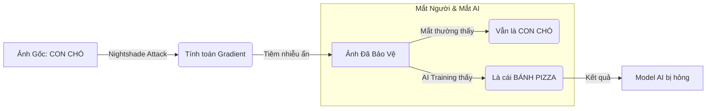
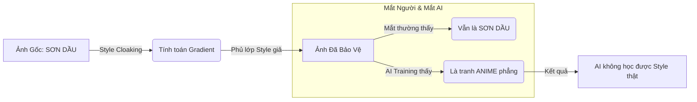

# Hope-AD


## Download

**[Download Hope-AD Installer (v1.0.0)](https://github.com/HopeADeff/Hope/releases)**

**Cách cài đặt:**
1. Tải file `Hope-AD-Setup-1.0.0.exe`
2. Chạy file cài đặt
3. Mở **Hope-AD** từ Desktop

---

## Mục Đích

Dự án được thiết kế để bảo vệ bản quyền hình ảnh bằng kỹ thuật **Adversarial Machine Learning**
- **Chống AI Training**: Ngăn chặn Stable Diffusion, Midjourney mimic style của bạn.
- **Nightshade (Poison)**: "Đầu độc" dữ liệu training. Mặc định biến概念 "Artwork" thành "Noise" (Nhiễu), khiến AI không thể học được khái niệm về tranh vẽ.
- **Style Cloaking (Glaze)**:

## Cơ chế hoạt động (How it works)

### 1. Nightshade (Đầu độc dữ liệu)
Cơ chế "gài bẫy" AI bằng cách thay đổi lớp hiển thị ma trận.



### 2. Glaze (Áo tàng hình phong cách)
Cơ chế "khoác áo giả" để che giấu nét vẽ thật.



## Chọn Noise hay Nightshade?

Khác nhau một trời một vực nha! 

| Tính năng | Dành cho ai? | Độ khó chịu cho AI |
|-----------|--------------|--------------------|
| **Noise (Adversarial)** | **Dân thường**: Chống mấy con bot cào ảnh linh tinh hoặc model đời tống. Nhẹ, nhanh, ko tốn GPU. | Thấp (Muỗi đốt inox) |
| **Nightshade (Poison)** | **Chiến thần**: Chơi khô máu với bọn training AI. Nó biến tranh của bạn thành "bả chó". AI học vào là ngộ độc, ói ra ảnh lỗi ngay. Mặc định nó biến "Tranh" -> "Nhiễu", hoặc bạn có thể chỉnh thành "Chó" -> "Mèo". | **Cực Cao (Chí mạng)** |
| **Glaze** | **Họa sĩ**: Bạn nào sợ bị AI nhái nét vẽ (Style Mimic) thì dùng cái này. Nó khoác cái áo tàng hình lên tranh, AI nhìn vào tưởng là style khác. | Cao |

> **Tóm lại**: Muốn nhẹ nhàng thì Noise. Muốn AI "sập nguồn" thì Nightshade. Muốn giữ bản sắc thì Glaze.


## FAQ

### Q: Tại sao tôi upload ảnh đã protect lên ChatGPT/Gemini, nó vẫn mô tả được bình thường?

**A: Tool bảo vệ "Phong cách" (Style), không phải che giấu "Nội dung" (Content).**

1. **Khác biệt về Mục tiêu**:
   - Hope-AD tấn công vào **CLIP Encoder** - "con mắt" của các AI vẽ tranh như Stable Diffusion/Midjourney.
   - ChatGPT/Gemini dùng các mô hình Vision hoàn toàn khác (lớn hơn gấp 100 lần) để hiểu nội dung.

2. **Cơ chế Bảo vệ**:
   - Mục tiêu của Glaze/Nightshade là ngăn AI **bắt chước nét vẽ** của bạn.
   - Việc Gemini nhận ra "trong tranh có con mèo" là bình thường. Nhưng nếu ai đó dùng ảnh đó để train AI vẽ "con mèo theo phong cách của bạn", AI sẽ thất bại.

### Q: Ảnh sau khi protect có bị vỡ nét không?
A: Tool sử dụng thuật toán tối ưu hóa để giữ sự thay đổi ở mức thấp nhất (gần như vô hình với mắt thường). Tuy nhiên, với setting `Intensity` cao, có thể xuất hiện nhiễu hạt nhẹ.

### Q: Nên chọn mức Intensity nào phù hợp (giống 80-90% gốc)?
**Khuyến nghị:**
- **Rất giống bản gốc (95%+)**: `0.05` (5%) -> Phù hợp nếu bạn muốn ảnh giữ nguyên vẻ đẹp tối đa.
- **Khuyên dùng (Balanced)**: `0.08 - 0.10` (8-10%) -> Cân bằng giữa bảo vệ và thẩm mỹ (giống ~90%).
- **Bảo vệ mạnh**: `0.15+` -> Có thể xuất hiện nhiễu (noise) nhẹ nhưng bảo vệ tốt hơn.

### Q: Tại sao các model AI vẫn tạo ra được nhân vật hoàn chỉnh từ ảnh được sử dụng phương pháp Glaze của tôi?
**A: Đây là sự khác biệt giữa hình thức Training và Inference:**

1. **Inference (Tạo ảnh/Img2Img)**: Khi bạn đưa ảnh vào để AI vẽ lại, AI có khả năng **khử nhiễu** (denoise) rất mạnh. Nó có thể nhìn xuyên qua lớp Glaze mỏng để tái tạo lại đường nét. **Glaze KHÔNG được thiết kế để chặn việc này :(.**
2. **Training (Học Style)**: Đây là mục đích chính của Glaze. Nếu ai đó dùng ảnh Glaze của bạn để **Train LoRA**, model đó sẽ bị hỏng (học ra nhiễu hoặc phong cách lập thể thay vì tranh gốc).

=> **Kết luận**: Việc AI vẫn nhìn thấy nhân vật để vẽ lại (i2i) là bình thường. Glaze bảo vệ bạn khỏi việc bị **đánh cắp style** để tạo ra Model riêng.

### Q: Độ tin cậy của phần mềm này cao không?
A: **Cao, nhưng không tuyệt đối.**

1.  **Về mặt Toán học**: Hope-AD sử dụng chung thuật toán lõi (Projected Gradient Descent) với bản chính gốc của ĐH Chicago (Glaze/Nightshade Team). Nên hiệu quả tấn công là tương đương.
2.  **Về mặt Thực tế**:
    *   **Hiệu quả cao (80-90%)**: Với các model phổ biến như Stable Diffusion 1.5, SDXL, NAI (Anime).
    *   **Hiệu quả thấp hơn**: Với các model quá mới hoặc kiến trúc quá khác (Midjourney v6, DALL-E 3) - do chúng không công khai mã nguồn để tấn công.
3.  **Thân lắm mới nói**: Nói thật lòng thì không có công cụ nào bảo vệ được 100% cả. Hope-AD giống như một cái "khóa cửa" xịn cho ngôi nhà nghệ thuật của bạn. Nó chặn được hầu hết những kẻ tò mò, táy máy tay chân lôi ảnh về train (chiếm đa số). Còn nếu gặp "cao thủ" (cỡ engineer google) cố tình phá khóa thì... chịu thật! Nhưng bạn yên tâm, tranh của mình chưa đến mức bị các đại ty để ý đâu. Cứ dùng để an tâm sáng tạo nhé! 😉

---

## Cài đặt cho dev/contributors

Nếu bạn muốn phát triển hoặc chạy từ mã nguồn:

```bash
git clone https://github.com/HopeADeff/Hope.git
cd Hope
.\setup.bat  
.\run.bat    
```

### Yêu cầu hệ thống (Source Code)
- Python 3.10+
- .NET 8.0+
- NVIDIA GPU (Khuyên dùng - nhanh hơn 20x so với CPU)

## Disk Space

| Phiên bản | Kích thước | Ghi chú |
|-----------|------------|---------|
| **Installer (.exe)** | **~130 MB** | Đã bao gồm tất cả (Python, Torch...) |
| **Source Code** | ~1 MB | Chưa bao gồm venv |
| **Installed (Full)** | ~3 GB | PyTorch + Dependencies |

## References & Credits

Dự án được xây dựng dựa trên các nghiên cứu khoa học:

- **Nightshade**: [Shawn Shan et al., "Nightshade: Prompt-Specific Poisoning Attacks on Text-to-Image Generative Models"](https://arxiv.org/abs/2310.13828)
    - *Reference details*: **Section 4 (Attack Design)**, pp. 6-8. Describes the optimization process for concept poisoning in latent space.
- **Glaze**: [Shawn Shan et al., "Glaze: Protecting Artists from Style Mimicry by Text-to-Image Models"](https://arxiv.org/abs/2302.04222)
    - *Reference details*: **Section 3 (Style Cloak)**, pp. 4-6. Explains the style shift perturbation method.
- **CLIP**: [OpenAI, "Learning Transferable Visual Models From Natural Language Supervision"](https://github.com/openai/CLIP)
    - *Reference details*: **Section 3.1 (Image Encoder)**, pp. 5-6. Basis for the feature extraction used in our loss functions.
- **High-Resolution Image Synthesis with Latent Diffusion Models**: [Rombach et al., CVPR 2022](https://arxiv.org/abs/2112.10752)
    - *Reference details*: **Section 3 (Method)**, pp. 4-9. The architecture of the Stable Diffusion model (UNet + VAE) used in the backend.
- **Towards Deep Learning Models Resistant to Adversarial Attacks**: [Madry et al., ICLR 2018](https://arxiv.org/abs/1706.06083)
    - *Reference details*: **Section 2 (The Saddle Point Problem)**, pp. 2-4. Defines the Projected Gradient Descent (PGD) algorithm, which is the core mathematical solver for Hope-AD.
- **Mist**: [Liang et al., "Mist: Towards Improved Adversarial Examples for Diffusion Models"](https://arxiv.org/abs/2305.12683)
    - *Reference details*: **Section 3.2 (Texture-based Attack)**, pp. 5. Similar approach to our "Noise" method.
- **Adversarial Example Generation for Diffusion Models (AdvDM)**: [Liang et al., 2023](https://arxiv.org/abs/2305.16494)
    - *Reference details*: **Section 3 (Methodology)**, pp. 4-6. Demonstrates optimizing adversarial noise directly on the latent reverse process.
- **Anti-DreamBooth**: [Le et al., ICCV 2023](https://arxiv.org/abs/2303.15433)
    - *Reference details*: **Section 3.1 (Defense Framework)**, pp. 4-5. Discusses targeted noise optimization to disrupt "DreamBooth" personalization (fine-tuning).
- **The Unreasonable Effectiveness of Deep Features as a Perceptual Metric (LPIPS)**: [Zhang et al., CVPR 2018](https://arxiv.org/abs/1801.03924)
    - *Reference details*: **Section 3**, pp. 3-5. Defines the perceptual loss metric (LPIPS) used to ensure the protected image looks identical to the original (Visual Quality Preservation).

## Special Thanks

- [Noah Trần](https://github.com/Coder-Blue)
- [Nguyễn Trí Nhân](https://www.facebook.com/nguyen.ala.142)
